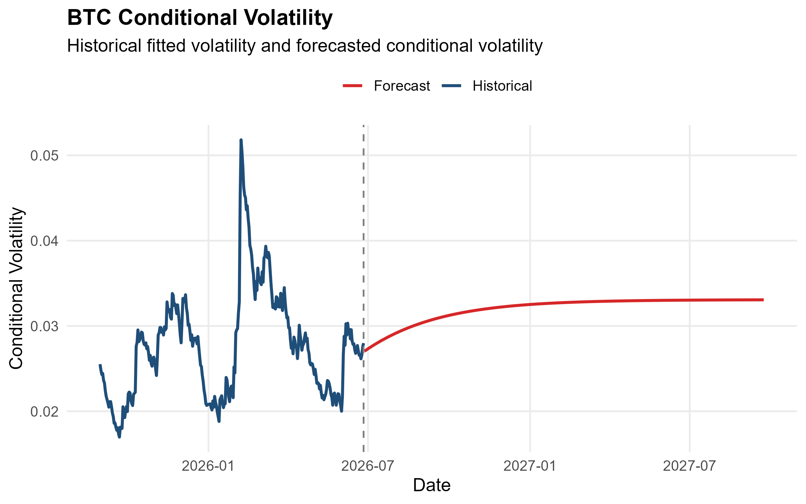
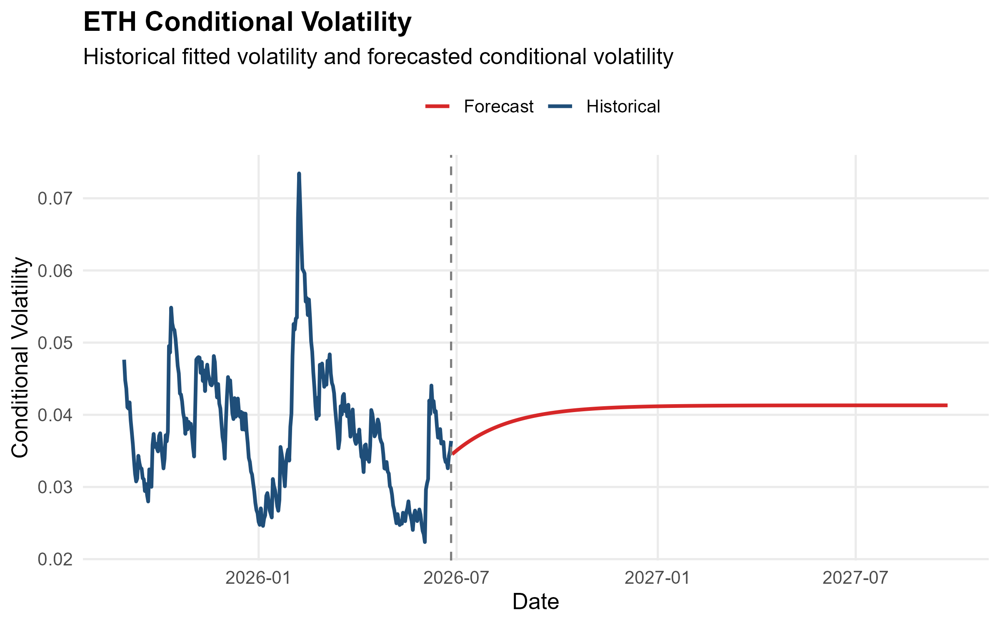
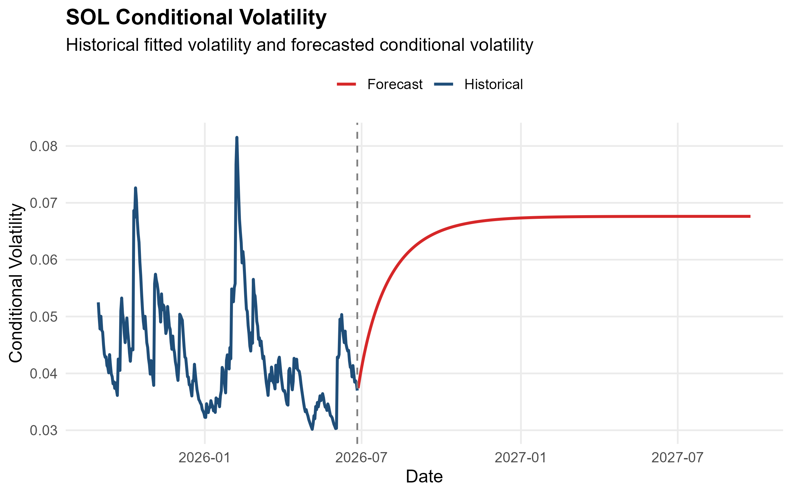
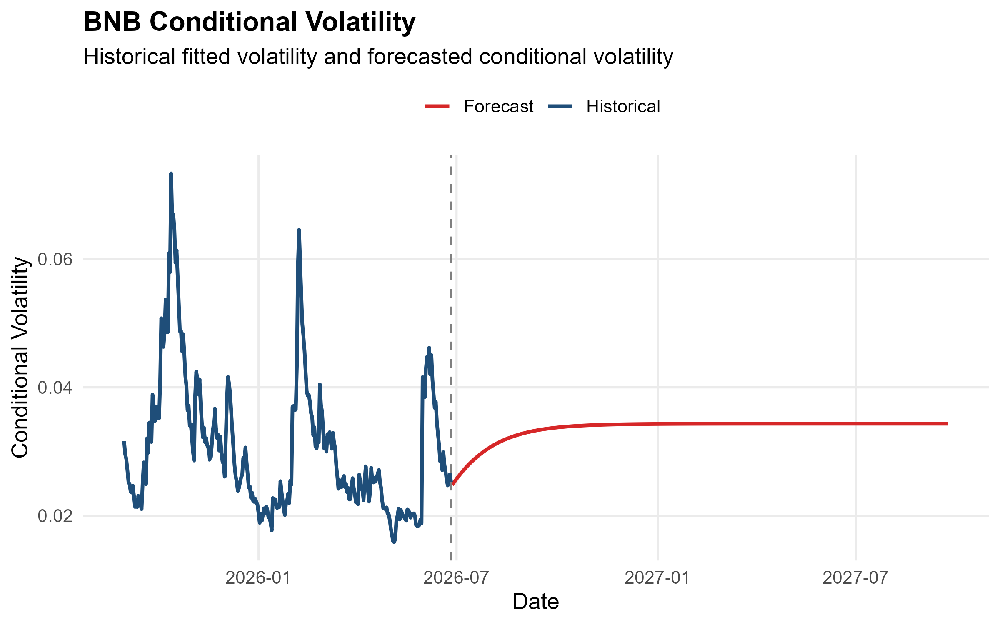
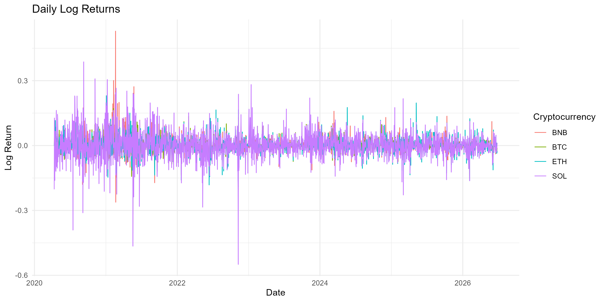

# Crypto Risk Analytics & Forecasting System

## Overview

This project develops an automated cryptocurrency volatility forecasting system using GARCH-family models in R. The workflow downloads market data, performs statistical diagnostics, estimates multiple volatility models, automatically selects the best-performing model, evaluates forecasting performance, and generates a reproducible analytical report.

The project demonstrates a complete financial econometrics pipeline suitable for quantitative finance, actuarial analytics, and risk management applications.

---

## Features

- Automatic download of cryptocurrency prices
- Data cleaning and preprocessing
- Exploratory data analysis
- Augmented Dickey-Fuller (ADF) stationarity tests
- ARCH effect testing
- Estimation of:
  - GARCH(1,1)
  - GJR-GARCH(1,1)
  - EGARCH(1,1)
- Automatic model comparison using:
  - AIC
  - BIC
  - Log-Likelihood
- Automatic best model selection
- Out-of-sample volatility forecasting
- Forecast evaluation using RMSE and MAE
- Value-at-Risk (95% and 99%)
- Automated Quarto report generation

---

## Cryptocurrencies

- Bitcoin (BTC)
- Ethereum (ETH)
- Solana (SOL)
- Binance Coin (BNB)

---

## Repository Structure

```
crypto-risk-analytics/

├── R/
│   ├── 01_data_download.R
│   ├── 02_data_cleaning.R
│   ├── 03_modelling.R
│   └── 04_forecasting.R
│
├── data/
│   ├── raw/
│   └── processed/
│
├── outputs/
│   ├── forecasts/
│   ├── models/
│   └── tables/
│
├── figures/
│
├── report/
│   └── report.qmd
│
└── README.md
```

---

## Methodology

1. Download historical cryptocurrency prices.
2. Calculate daily log returns.
3. Test stationarity using the ADF test.
4. Test for ARCH effects.
5. Estimate GARCH-family models.
6. Compare models using AIC, BIC, and Log-Likelihood.
7. Automatically select the best-performing model.
8. Forecast future conditional volatility.
9. Evaluate forecasting accuracy.
10. Calculate Value-at-Risk.

---

## Example Outputs

The project automatically generates:

- Log return plots
- Return histograms
- Volatility forecasts
- Model comparison tables
- Forecast accuracy tables
- Value-at-Risk tables
- Automated Quarto HTML report

---

## Results

### BTC Conditional Volatility Forecast



### ETH Conditional Volatility Forecast



### SOL Conditional Volatility Forecast



### BNB Conditional Volatility Forecast



### Daily Log Returns



### Return Histograms


### Performance Summary


---

## Software

- R
- Quarto

---

## Installation

Install the required packages:
install.packages(c(
  "tidyverse",
  "quantmod",
  "rugarch",
  "PerformanceAnalytics",
  "tseries",
  "knitr",
  "quarto"
))

## Future Improvements

- Rolling-window forecasting
- Multivariate GARCH models
- Machine learning volatility models
- Forecast confidence intervals
- Interactive dashboards


## Author

Elliot Yang
